# **🌾 Agro Farm : Potato Disease Classification 🥔🌱**

## 🌟 Project Overview

Agro Farm is an intelligent AI application designed to classify diseases in potato plants using advanced deep learning techniques. This project leverages a Convolutional Neural Network (CNN) model to identify potato diseases with high accuracy. The backend API is powered by FastAPI, ensuring efficient processing and serving of predictions, while the React framework is utilized for building an interactive client-side interface for seamless user experience.

## 🌐 View Live Demo of the Project

You can view the live demo of the Agro Farm: Potato Disease Classification project here:

[Live Demo](https://agrofarm-bkwd.onrender.com/)

Experience how it works in real-time! Upload a potato leaf image and get instant predictions for the plant's health status, all powered by a CNN-based model and served via FastAPI. 🌾🍃

## 📊 Dataset: Plant Village Overview 🌱📸
For this project, we use the Plant Village Dataset sourced from Kaggle. This comprehensive dataset includes images of various plant diseases, such as those affecting tomatoes and bell peppers, alongside our primary focus—potato diseases.

**Link to the dataset [here](https://www.kaggle.com/datasets/arjuntejaswi/plant-village)**

### 📝 Dataset Customization
- Download the Dataset: Obtain the Plant Village dataset from Kaggle.
- Data Filtering: Remove directories related to tomato and bell pepper diseases to narrow the dataset to potato diseases only.
- Loading with TensorFlow Dataset:
- Use tf.data.Dataset to load and manage image data effectively.
- Why tf.data.Dataset? This method organizes images into batches, streamlining the data processing workflow and enabling the use of functions like .filter() and .map() for enhanced data manipulation.

## 📸 Screenshots

Here are some screenshots of the Agro Farm: Potato Disease Classification in action! 🌾

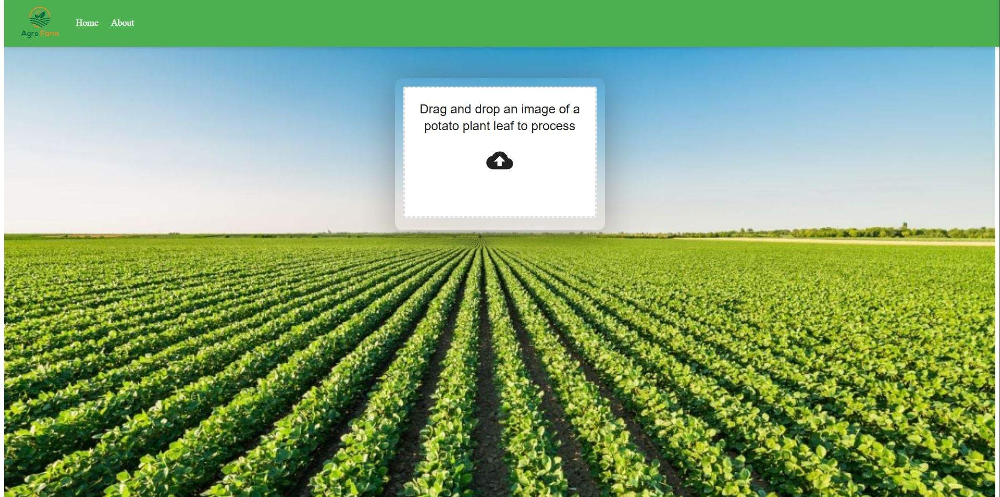


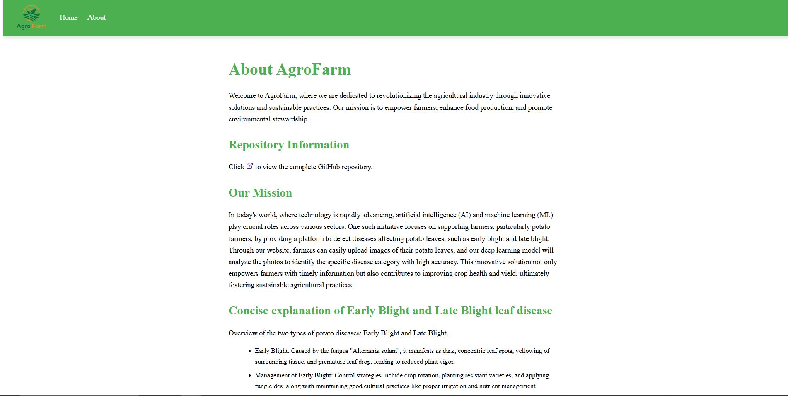


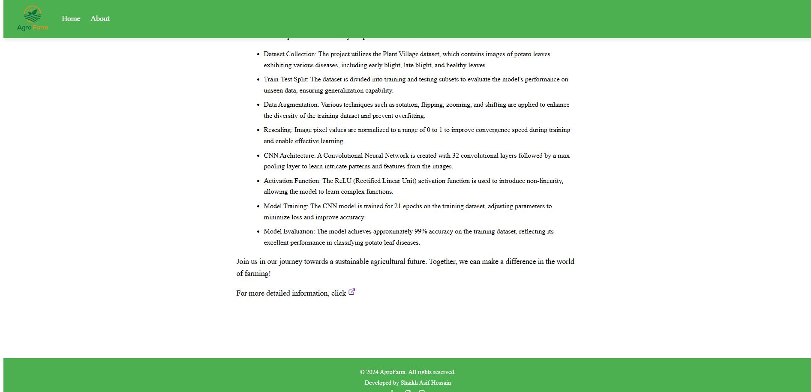


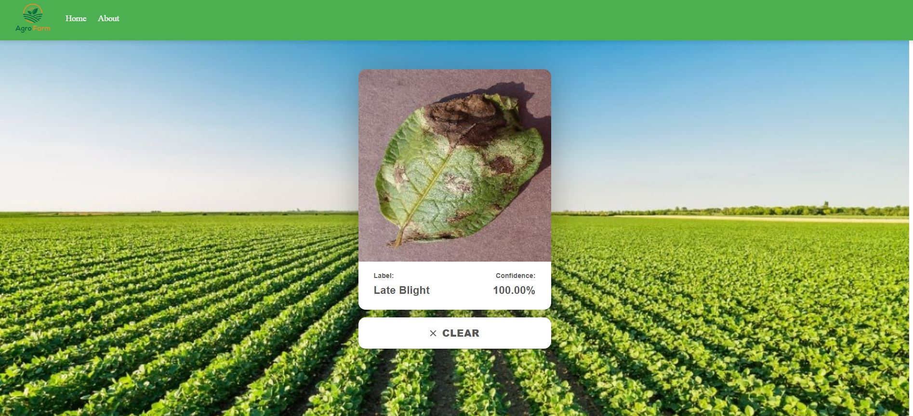


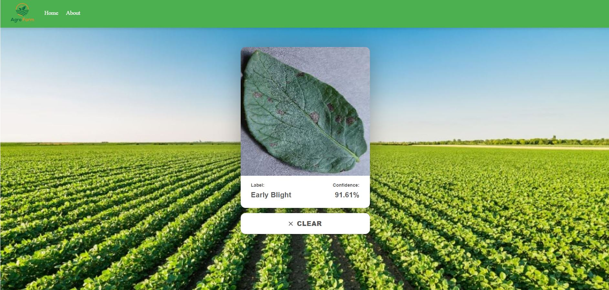


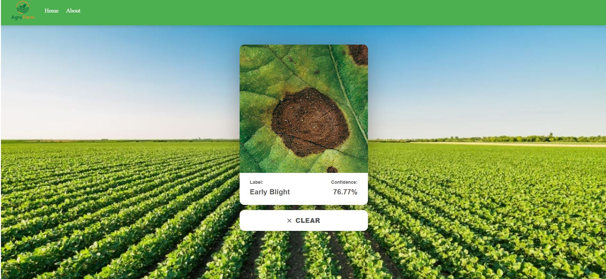


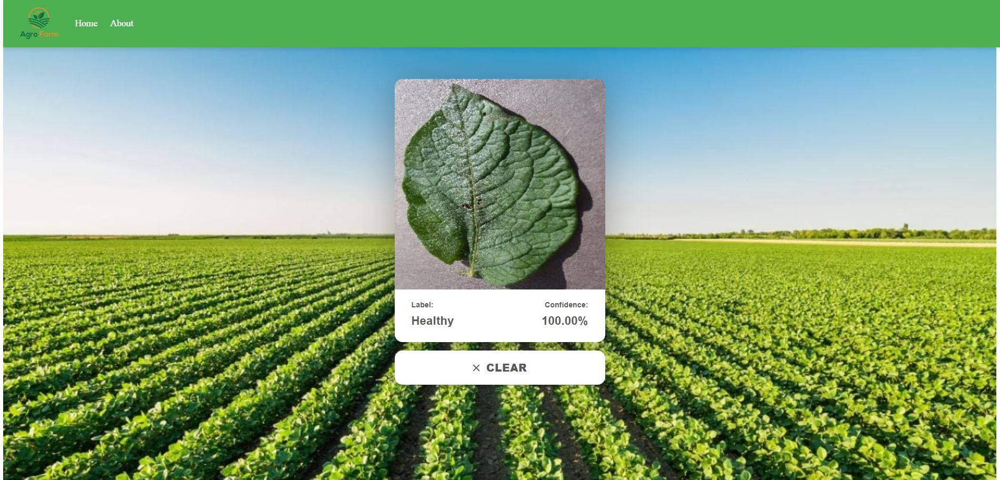


## 🧠 Creating and Explaining the Model Step by Step
### Step 1: Importing Essential Libraries

We begin by importing two essential libraries:

- TensorFlow: Used to train our neural network model.
- Matplotlib: Used for visual representation of the results and data.

### Step 2: Loading the Data
We use the tf.keras.preprocessing.image_dataset_from_directory function to load the dataset. This method automatically classifies the images based on the directory structure. In this case, there are three classes representing different potato diseases.

- Image Size: The images are resized to 256x256 as per the dataset specifications.
- Batch Size: We use a batch size of 32 to control how many images are processed at a time.
- Class Names: The class names are derived from the folder names in the dataset.

### 🛠️ Batch Size Explanation
Batch size refers to the number of training examples (images, in this case) that the model processes before updating its weights during training. It is an important hyperparameter that controls the speed and stability of the training process.

- Smaller Batch Sizes (e.g., 8, 16): Often result in noisier gradient estimates, but can lead to a more robust model since the model updates more frequently with each batch.
- Larger Batch Sizes (e.g., 32, 64, 128): Usually give more stable gradient estimates but require more memory and computational power. They tend to converge faster.
For this project, we have chosen a batch size of 32. This strikes a balance between speed and stability, allowing the model to learn efficiently without overwhelming the available computational resources.

### Step 3: Visualizing the Images
Before proceeding with model training, the images are visualized to get an understanding of the data distribution and visual features.

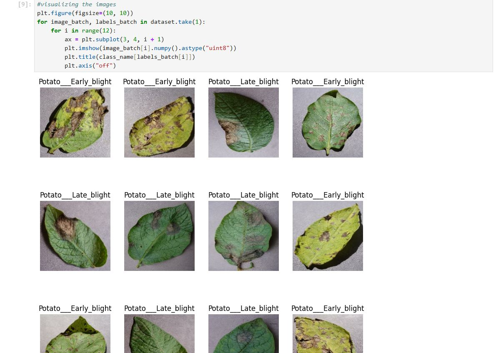

### Step 4: Data Preprocessing
In this step:

* The images are resized and rescaled to normalize pixel values.
* Data Augmentation: Techniques like random flipping and random rotation are applied to increase the variety in the training data and reduce overfitting.

### Step 5: Splitting the Dataset
The dataset is split into training, validation, and testing sets:

* 80% of the data is used for training.
* 10% is used for validation, and 10% for testing.
* Validation Set: This set is used during training to evaluate the model’s performance after each epoch. It helps to detect overfitting and ensures the model generalizes well.

## 🏗️ CNN Architecture Overview
The CNN architecture consists of several key layers, each responsible for performing a specific function in the image processing pipeline:

1. Conv2D Layers 🖼️
These layers apply convolutional filters to detect local patterns, such as edges, textures, or more complex features like shapes or objects. As the depth of the network increases, the network learns increasingly abstract features.
In this model, we use 32, 64 filters in the first few layers to capture simple patterns, and this increases with the network's depth.

Details of Conv2D Layers:

* Conv2D (32 filters): The first convolutional layer applies 32 filters (3x3 kernel size) to the input image, detecting basic features like edges.
* Conv2D (64 filters): As we move deeper, the network applies 64 filters to capture more complex patterns.
* We use padding='same' to ensure that the output image has the same dimensions as the input, preventing size reduction after convolutions.
  
2. MaxPooling2D Layers ⬇️
   
These layers downsample the feature maps by selecting the most important information. It reduces the spatial dimensions (height and width) of the image, helping the network focus on the most important features.
MaxPooling layers use a 2x2 pool size, meaning they reduce the dimensions by half after each pooling operation.

3. Flatten Layer 🔄
   
The Flatten layer converts the 2D feature maps into 1D vectors, so the data can be passed into the fully connected Dense layers. This is a crucial step before the final classification layers.

4. Dense Layers 💡

Dense layers are fully connected layers where every neuron in the layer is connected to every neuron in the previous layer. They interpret the features learned by the convolutional layers and make the final classification decision.

* The first Dense layer uses 64 neurons to learn higher-level representations of the features.
* The output Dense layer uses 3 neurons (since we have 3 classes) and applies the Softmax activation function to output class probabilities.


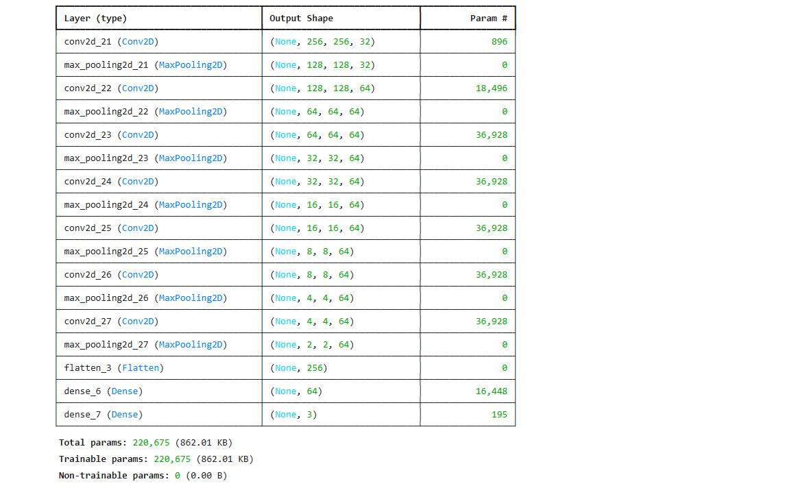


### 🎯 Activation Functions: ReLU & Softmax

ReLU (Rectified Linear Unit):

* Used in all hidden layers to introduce non-linearity and enable the network to learn complex patterns.
* It is computationally efficient and helps mitigate the vanishing gradient problem.
  
Softmax:

* Applied to the output layer for multi-class classification.
* Converts the raw output scores into probabilities, allowing the model to predict the most likely class.

### Step 7: Compiling and Training the Model

The model is compiled using the following:

* Loss Function: SparseCategoricalCrossentropy(from_logits=False) is used. This loss function is suitable for multi-class classification when the target labels are integers (not one-hot encoded). It calculates the difference between predicted class probabilities and the true labels.
* Optimizer: Typically, the Adam optimizer is used for faster convergence.
* Metrics: Accuracy is tracked during training.
  
The model is trained for 21 epochs, and with this number of epochs, a high accuracy is achieved, reaching 99% on the test dataset.

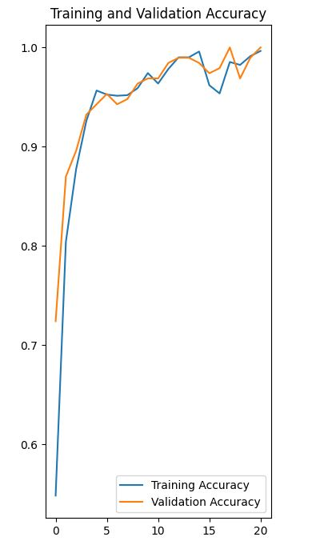


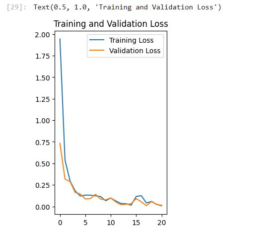

### Step 8: Making Random Predictions

After training, random predictions are made to verify the model's performance in real-world scenarios.

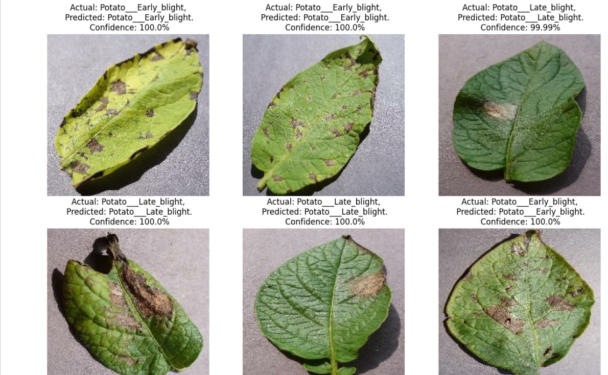

### Step 9: Saving the Model

The model is saved to the disk for future use:

```
import os
os.makedirs("./models", exist_ok=True)

model_version = max([int(i) for i in os.listdir("./models") if i.isdigit()] + [0]) + 1
model.save(f"./models/{model_version}.h5")
```

## 🚀 FastAPI - Backend 🌱

In this step, we create a FastAPI application that serves the trained CNN model for predicting potato diseases based on uploaded images. The backend is built using FastAPI, TensorFlow for inference, and PIL for image processing. This API receives an image, processes it, and returns the predicted disease and the confidence score.

### 🛠️ FastAPI Setup

#### 1️⃣ Importing Essential Libraries 📚

We start by importing the essential libraries:

- FastAPI and its related modules (File, UploadFile) to handle API requests and file uploads.
- TensorFlow for loading and using the trained deep learning model.
- Pillow (PIL) for image processing, resizing, and handling.
- Uvicorn to run the FastAPI server.
- Logging to log messages and errors in a structured way.

#### 2️⃣ Logging Setup and Model Loading 📑

- We set up logging to monitor the API and check for any issues. The model is loaded from a specified path using TensorFlow. If loading fails, we log the error and stop execution.

### 3️⃣ Setting Up CORS Middleware 🌍

- CORS middleware is added to allow cross-origin requests, which is useful when the API is called from different domains (like a frontend).

### 4️⃣ Root Endpoint 🌱

- A simple GET endpoint (/) is created to verify that the server is running and reachable.

### 5️⃣ Image Upload and Processing 📸

- A function processes uploaded images, converting them into a NumPy array after resizing them to a standard size (256x256 pixels).
- This ensures the image can be passed into the model for inference.

### 6️⃣ Predict Endpoint 🤖

- A POST endpoint (/predict) is created to accept an image file upload.
- The image is processed and passed to the trained model for predictions.
- The model's output is interpreted, returning the predicted disease class and confidence score.

### 7️⃣ Run the Server 💻

- The API is served using Uvicorn, making it available on localhost:8000.
- The server can be started via a terminal command, making it accessible to users.

### 🎯 Key Features

- Efficient Model Inference: The model is used to classify images uploaded by users, predicting the disease type in potato plants.
- Real-time Prediction: Once an image is uploaded, the system returns the predicted disease class and the model's confidence in that prediction.
- Simple API Design: FastAPI makes it easy to set up endpoints and handle image data efficiently.


## 🎨 Frontend - User Interface for Disease Classification 🌾

The frontend of the Potato Disease Classification system is built using React, offering a simple and intuitive user interface. 🌟

### 📱 Key Features:

- Image Upload: Users can easily upload potato plant images for disease prediction with a sleek drag-and-drop feature or by selecting an image from their device. 📸
- Real-time Feedback: Once the image is uploaded, the frontend interacts with the backend API and displays the predicted disease along with the confidence score in a visually appealing format. 🧑‍⚕️💯
- Responsive Design: Whether on desktop or mobile, the frontend adapts seamlessly to provide a smooth user experience. 📱💻
  
With React and Tailwind CSS (for styling), the interface is not only user-friendly but also modern and responsive. Ready to classify potato diseases with just a few clicks! 🌱✨


## 🚀 How to Use the Potato Disease Classification Project 🌱

Follow these simple steps to get started with the Potato Disease Classification project! Whether you're setting up the backend or the frontend, this guide will walk you through the entire process. Let's dive in! 🏄‍♂️✨

### 🛠️ Pre-requisites

Before starting, make sure you have the following installed:

- Python 3.7+ 🔥
- Node.js (for React frontend) ⚡
- TensorFlow (for model training & predictions) 🧠
- FastAPI (for backend API) ⚙️
- React (for frontend UI) 💻
- Uvicorn (to run FastAPI) 🔥

#### 1️⃣ Clone the Repository

Clone the repository to your local machine using Git:
```
git clone https://github.com/yourusername/Potato-Disease-Classification.git
cd Potato-Disease-Classification
```

#### 2️⃣ Backend Setup - FastAPI

The backend handles the model loading and prediction. Follow these steps to get it running! 🔥

🔥 Install Dependencies

Navigate to the backend directory and install the necessary Python packages:
```
cd backend
pip install -r requirements.txt
```

🌟 Set the Model Path

Ensure your pre-trained model is located at the correct path in the code. Update the MODEL_PATH in the main.py file.

🚀 Run the API

Run the FastAPI server using Uvicorn:
```
uvicorn main:app --host localhost --port 8000 --log-level info
```

Your backend API should now be running at http://localhost:8000! 🎉

#### 3️⃣ Frontend Setup - React

Now, let's get the frontend up and running, where you can upload images and get predictions! 🚀

🌱 Install Dependencies

Navigate to the frontend directory and install the required React dependencies:

```
cd frontend
npm install
```

🎨 Run the Frontend

To start the frontend, run the following command:
```
npm start
```

This will launch your React application at http://localhost:3000! 🎉

#### 4️⃣ Image Upload & Prediction

Once both the backend and frontend are running, follow these steps to make predictions:

- Open the frontend app in your browser (http://localhost:3000).
-  Upload a potato plant image by either dragging and dropping the image into the upload section or selecting it from your file explorer. 📸
-  The app will send the image to the backend API, which will process it using the pre-trained model and return the predicted disease class (e.g., "Early Blight", "Late Blight", or "Healthy"). 🌿
-  Confidence score is also shown, representing how confident the model is about its prediction. 💯

  
#### 5️⃣ Additional Resources: Jupyter Notebook 📚

If you're interested in exploring the model further or experimenting with different datasets, you can also find the Jupyter Notebook (.ipynb file) uploaded in the repository! This notebook contains the step-by-step process of training and evaluating the model, and can serve as a great resource for understanding the inner workings of the classification model.

#### 6️⃣ Troubleshooting

- Backend not running? Double-check the MODEL_PATH in the FastAPI code and ensure that all dependencies are installed.
- Image upload failing? Ensure your image is in the correct format (.jpg, .png), and the image dimensions are compatible with the model (256x256 pixels).
- Can't connect to the API? Make sure both backend and frontend servers are running on the correct ports (localhost:8000 for the API and localhost:3000 for the frontend).
  
📝 Conclusion

That's it! 🎉 You've now set up the Potato Disease Classification system. With just a few simple steps, you're ready to classify potato plant diseases in real time! 🌱

Feel free to experiment with different images, improve the model, and contribute to the project! 🙌

Enjoy classifying those potato diseases! 🥔👩‍🌾


## 🌟 What I Learned from the Project 🌟

Working on the Potato Disease Classification project was an exciting and enriching experience! Here's what I learned:

- Deep Learning Model Creation & Training: I gained hands-on experience in building and training a Convolutional Neural Network (CNN) using TensorFlow to classify images of potato diseases. I learned how CNNs work for image classification tasks, and the importance of data preprocessing, augmentation, and splitting the dataset into training, validation, and test sets.

- FastAPI for Backend: I explored FastAPI, which enabled me to efficiently set up the backend for serving the model and handling image predictions. FastAPI's simplicity and speed made it a great choice for building a REST API that could receive images, process them, and return predictions.

- React for Frontend: By integrating the React frontend with the backend API, I learned how to manage image uploads, make API requests, and display the model's predictions in a user-friendly interface. This helped me bridge the gap between machine learning and web development.

- Deployment Basics: I gained insights into setting up a full-stack application that involves training a machine learning model, building a backend API, and creating an interactive frontend interface. This project improved my understanding of how to bring ML models into real-world applications.

- Handling Real-World Data: Working with real-world images, I learned how to handle image data, pre-process it, and augment it to improve the model's accuracy. The importance of model validation and accuracy measurement was reinforced.


## 🚀 Further Improvements and Next Steps 🚀

While the project is a success in its current form, there are several ways to take it to the next level:

#### 📦 Use Docker for Containerization

- By containerizing the application with Docker, I can ensure that the project runs seamlessly across different environments. This will also make deployment easier and more efficient.

#### ☁️ Hosting on AWS

- Hosting the project on a cloud platform like AWS would make it accessible online and allow others to use the potato disease classification model. I could deploy the backend using AWS EC2 and S3 for storage and host the frontend with AWS Amplify or S3 static hosting.

#### 🔍 Better Prediction with Real Images

- Currently, the model performs well with the dataset used for training. However, for real-world applications, improving predictions with real, varied images of potato plants would be crucial. This would involve collecting more diverse data from different sources, potentially fine-tuning the model to make it more robust to varying conditions like lighting, angles, and plant health stages.

#### 🌱 Expand the Project to Agro-Farm Disease Detection

- The project could be expanded to create a comprehensive agro-farming solution. By adding more plant species and diseases, this tool could help farmers detect various plant diseases, providing a broader impact. I could include more types of plants like tomatoes, crops, etc., and expand the classification model to recognize multiple plant species and the diseases that affect them.

#### 🌍 Integrating AI for Real-Time Diagnostics

- I could add a feature that not only predicts the disease but also suggests treatment recommendations based on the disease detected. This would make the system more interactive and useful for farmers to take immediate actions in real-time.

#### 📊 Improving the UI/UX of the Frontend

- While the current frontend serves the purpose, a more sophisticated and user-friendly interface can be developed. Features like drag-and-drop upload, real-time notifications, and detailed disease descriptions would improve the overall user experience.

## 🙏 Thank You for Exploring This Project! 🙏

I hope you found this project insightful and inspiring. It was a fun journey of learning and applying various technologies, from machine learning and FastAPI to frontend development with React. The Potato Disease Classification model is just the beginning, and there are endless possibilities to expand and improve it.

If you found this project useful or have any questions, feel free to open an issue or reach out to me. Contributions and suggestions are always welcome! 🤝

### 🔗 Links & Resources
GitHub Repository: [Potato Disease Classification](https://github.com/asifhossain12/AgroFarm)

Model Notebook: You can also find the Jupyter Notebook (.ipynb) file uploaded for hands-on experimentation. 📓

Happy Coding! 💻🚀

Shaikh Asif Hossain


  


